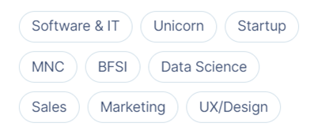
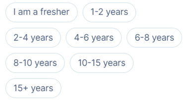
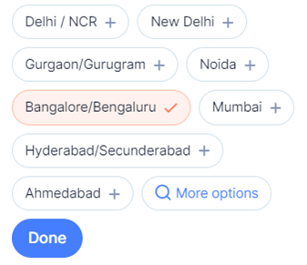
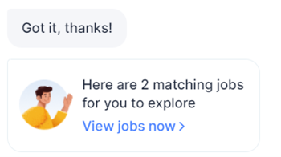
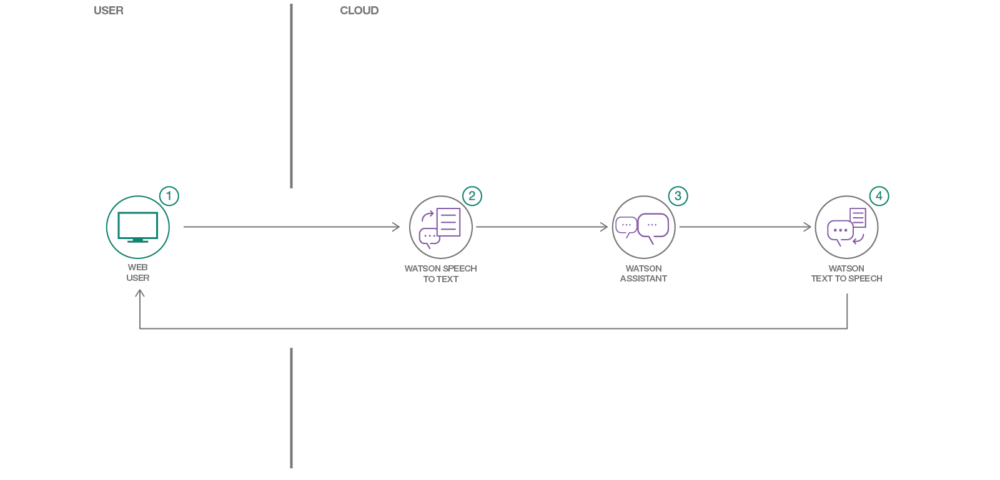

# Saheli 

## A next-gen “responsible” bot catering to women returning to work after a career break
[](https://www.apache.org/licenses/LICENSE-2.0)
#### The issue: Women in India on career break faces lot of hurdles to restart their career.

According to a study conducted by the Genpact Centre for Women’s Leadership, about 50 percent of working women in India leave their jobs to take care of their children at the age of 30. Even among those who manage to return, a huge fraction drops out within four months of rejoining the workforce which is very alarming.
The report added that after becoming mothers, only 27 percent of women advance in their careers and continue to be part of the workforce. 

The most common reason most women take career breaks is to tend to children. They either take maternity leave, have a child or take time off to take care of a child. Childcare also happens to be a full-time job.

In another survey conducted by job site Indeed, titled ‘Women rejoining work post-COVID-19’, about 58 percent of women respondents believe that over the last two years, female employees quit their jobs to take on more family responsibilities, such as childcare. A significant proportion of employers (39 percent) agreed with the view that female employees quit their organizations over the last two years because of family responsibilities.


### Market Research:
While thinking about restarting their career – women – face lot of hurdles. Many of them tend to come from their families itself. Some of the questions posed against them are:

•	Will I be able to return to my old position at work? 
•	How do I develop new skills? 
•	Will I be able to cope with changes in the industry? 
•	How will I manage both work and home? 

These are some of the niggling doubts women face as they contemplate returning to work after a break. 
So our team did a rigorous market research and found that the existing solutions / platforms (like job portals, career websites etc) are not tailor made as per their requirements.

Gaps in current eco-system:
	Too generic
	No personalization
	UI is not user friendly
	Transparency is not maintained
So, they often stop taking the initiative itself.
### Hypothesis:
1.	Users have access to the internet
2.	All women know how to surf through internet
3.	Women should know how to read and write in their first language
### Stake holders: 
    •	Women in Corporate Industry
    •	Age group range in focus: 20–60
### Stakeholder Situations:
    •	When they realize that they are ready to restart their career
    •	When they are not sure of where to start 
    •	When they need information, knowledge to help assess their situation
### Solution: Powering women to return to work with help of IBM’s conversational AI

Our team felt the responsibility of helping the women with the help of technology. We brainstormed several ideas by employing the design thinking approach and found that:
- Existing apps have unwanted features that were very time consuming.
    - Outcome: Decided to make the user experience as simple as possible as it helps the user gain a positive experience
- Existing apps are not transparent enough and not trustworthy.
    - Outcome: Decided to make our solution trustworthy by including the guiding principles of Responsible AI

So, the solution to this problem can be an AI-based responsible chatbot called **SaheliBOT** where women can chat with it and:
- Find relevant job opportunities
- Know more details about the job 
 
So why choose a **"responsible"** bot? Reason being:
•	Available 24/7
•	Scalable with lower costs
•	Greater personalization
•	Ideal for a repetitive and transactional use case with a testable result
•	Transparent
•	Trustworthy

### SaheliBOT Personality: 
•	Friendly (Saheli means friend in Hindi language)
•	Gives a sister feeling 

### Bot goals:
1.	Intelligent
2.	Fast & Accurate
3.	Secure
4.	Easy to access (accessibility built-in with Translator option)

### High Level flow:

- Step 1. Welcome to Saheli. I am a bot who can help in finding a job for you regardless of the reason or the length of your break. So, what kind of jobs are you interested in? Show cards like:
    - 
- Step 2. Got it! How much work experience do you have?
    - 
- Step 3. Alright! Which cities are you looking for jobs in?
    - 
- After clicking Done, Show the results like below in the chat window.
    - 
- If they click "View Jobs" - it will take them to external site
- Else if they click "start over" (not shown in flow), it should restart the process

Saheli is a Web based chat bot, here is that we'll be using voice input and output. For the conversation dialog we'll of course be using Watson Assistant, but we'll also be using Watson Speech To Text to capture the user's voice, and lastly we'll use Watson Text To Speech to playback the chatbots response to the user. The web application itself is built on top of JQuery and Python Flask.

The Flow of the code pattern :

* Make a Watson Speech To Text call using a Web Socket Connection
* Make a Watson Text to Speech REST API call
* Send and receive messages to Watson Assistant using REST APIs
* Integrate Watson Speech To Text, Watson Text To Speech and Watson Assistant in a web app



### Flow

1. User selects the microphone option on the browser and speaks.
2. The voice is passed on to Watson Speech To Text using a Web Socket connection.
3. The text from Watson Speech to Text is extracted and sent as input to Watson Assistant.
4. The response from Watson Assistant is passed onto Watson Text to Speech.
5. The audio output is sent to the web application and played back to the user, while the UI also displays the same text.

### Included components

* [Watson Speech-to-Text](https://www.ibm.com/watson/services/speech-to-text/): A service that converts human voice into written text.
* [Watson Text-to-Speech](https://www.ibm.com/watson/services/text-to-speech/): Converts written text into natural sounding audio in a variety of languages and voices.
* [Watson Assistant](https://www.ibm.com/watson/ai-assistant/): Create a chatbot with a program that conducts a conversation via auditory or textual methods.

### Featured technologies

* [Flask](http://flask.pocoo.org/): Python is a programming language that lets you work more quickly and integrate your systems more effectively.
* [jQuery](https://jquery.com/): It is a cross-platform JavaScript library designed to simplify the client-side scripting of HTML.

### Sample output

Follow the script below for a sample conversation with Saheli.

```text
Saheli: Welcome to Saheli. I am a bot who can help in finding the best career options for you regardless of the reason or the length of your break.
User Reply: I am housewife, want to restart my career

Saheli: You have come to the right place. I will help you in guiding the career path, Before that could you let me know few questions ?
What is your educational background ?
User Reply: Degree

Saheli: What kind of jobs are you interested in? Like Software & IT, Data Science, Sales, Marketing
User Reply: Data Science

Saheli: How much work experience do you have ?
User Reply: I am a Fresher

Saheli: Alright! Which cities are you looking for jobs in? Like Mumbai, Pune
User Reply: Mumbai

Saheli: Thank you, we found the details below, based on your technology selection :

you can see the insights of the hiring trends of the technology to have selected :

https://insights.naukri.com/career-tools/skills-trends/demand-for-data-science, https://insights.naukri.com/career-tools/tech-careers/how-to-become-data-analyst

List of Job Recommendations based on your technology selection :

https://insights.naukri.com/career-tools/tech-careers/top-companies-for-data-analyst
User Reply: ok Thanks

Saheli: Thank you, Have a great day!

More about the latest/trending technologies in the current IT market to kickstart your career
Top 10 Trending Technologies in 2022:
HyperAutomation
Cybersecurity
Full Stack Development
Blockchain
Snowflake
Edge Computing
Internet of Behaviors
Predictive Analytics
Devops
AI as a Service

Saheli: Welcome to Saheli. I am a bot who can help in finding the best career options for you regardless of the reason or the length of your break.
```

### Links

* [Watson Node.js SDK](https://github.com/watson-developer-cloud/node-sdk)
* [Relevancy Training Demo Video](https://www.youtube.com/watch?v=8BiuQKPQZJk)
* [Relevancy Training Demo Notebook](https://github.com/akmnua/relevancy_passage_bww)

### Deployment options

Click on one of the options below for instructions on deploying the app.

|   |   |   |
| - | - | - |
| [](doc/source/openshift.md) | [](doc/source/cf.md) | [](doc/source/local.md) |

### Future roadmap
 - Include feature for booking a interview right from the bot
 - Include a new section called "Education" which will enable women to search and pursue education after a break
